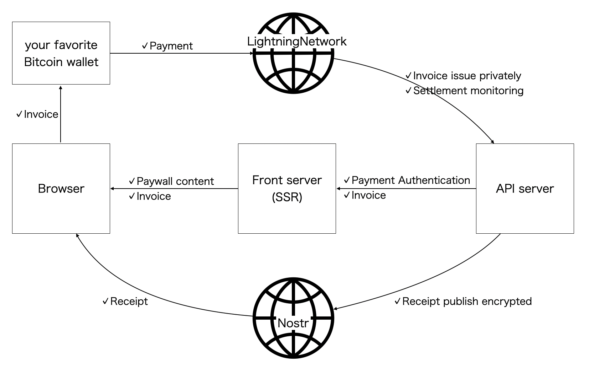
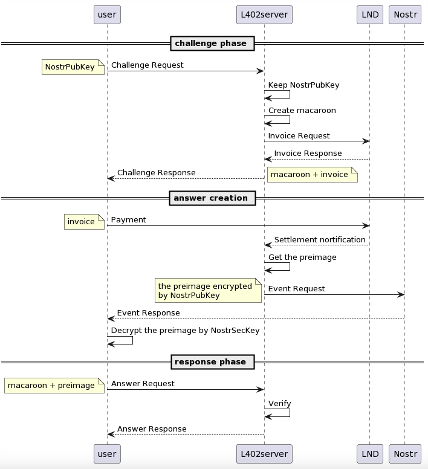

# Self-Sovereign Blog

This blog, "Self-Sovereign Blog", is a showcase for "Paywall Without Intermediaries". It will also be a showcase for Bitcoin as a medium of exchange.

https://github.com/studioTeaTwo/self-sovereign-blog/assets/1317305/ea5cdf72-0c93-4a93-aeae-d667a879c9b0

There are three keys to realizing above: Self-made, Bitcoin, and Nostr.

Blog is handcrafted by JavaScript framework, SvelteKit, and can be hosted anywhere. Payments for paywall use Bitcoin which is the border-less internet native money, specifically Lightning Network which is the layer2 of Bitcoin and enables fast finality and micro payments. The proof of payment is shared between buyers and sellers through messaging using the Nostr protocol.

Both Bitcoin and Nostr are the people's network without specific authorities. So, this paywall is "Self-Sovereignty", with no middlemen involved.

## Overview

The front server is responsible for:

1.  delivering blog posts that are markdown-based
2.  unlocking paywalled content
3.  delivering invoices to remove the paywall
4.  setting up to subscribe to encypted messages to share the payment proof
5.  asking payment authentication/authorization related to all of the above to the API server

Payment authentication/authorization for paywall follows the [Lightning HTTP 402 Protocol (L402 protocol)](https://github.com/lightning/blips/pull/26) that repurposes the `HTTP 402 Payment Required` error code and is a standardized way of adding micropayments to any existing HTTP-REST or gRPC API.

The API server coodinates two networks that are Lightning Network for payments and Nostr protocol for messagings, and executes L402 protocol. You can check the [sample implementation](https://github.com/studioTeaTwo/simple-l402-server) for this blog which wraps the L402 API Key proxy called [Aperture](https://github.com/lightninglabs/aperture).

Lightning Network is Bitcoin's layer2 used for payment network. Bitcoin is decentralized internet money, so users can pay from any wallet that supports Lightning Network.

Nostr protocol is a decentralized network similar to Bitcoin, which is used on this blog to share the proof of payment safety and securely without the need for any counterparty. To achieve this, we adopt [NIP-04](https://github.com/nostr-protocol/nips/blob/master/04.md) to exchange direct message encrypted with AES-256-CBC.

## L402 protocol flow

Details are explained in [this post](https://self-sovereign.blog.teatwo.dev/articles/004_paywall-without-intermediaries).

## References

I appreciate for the following codebases in addition to those listed in package managers that are very helpful in this development.

- Handcrafted blog by svelte
  https://github.com/mattjennings/sveltekit-blog-template
- Nostr client by svelte
  https://github.com/SnowCait/nostter
- Nostr client by svelte
  https://github.com/akiomik/nosvelte
- Apertue demo
  https://github.com/ellemouton/aperture-demo
