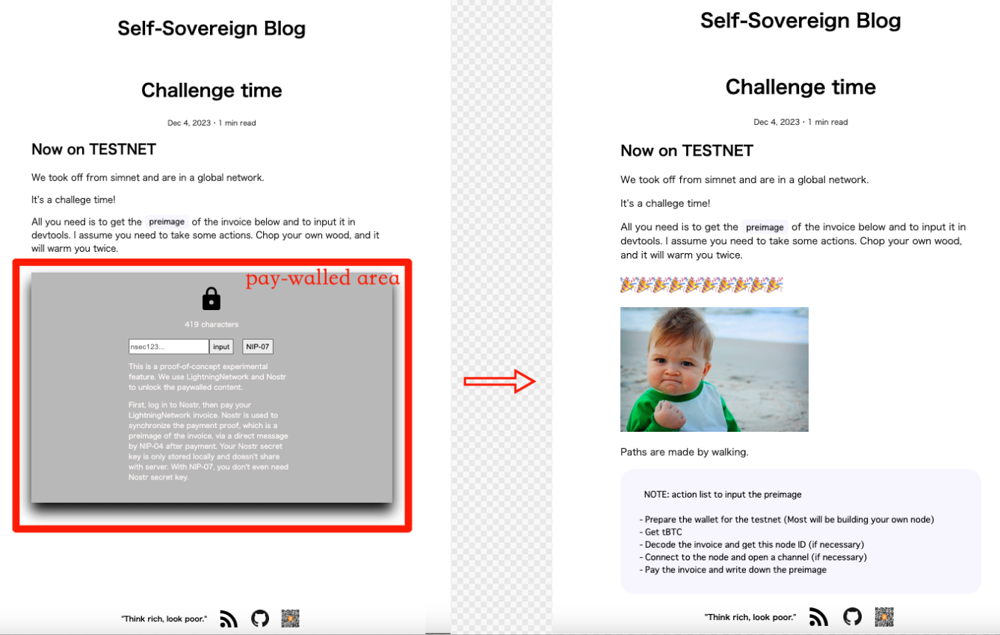
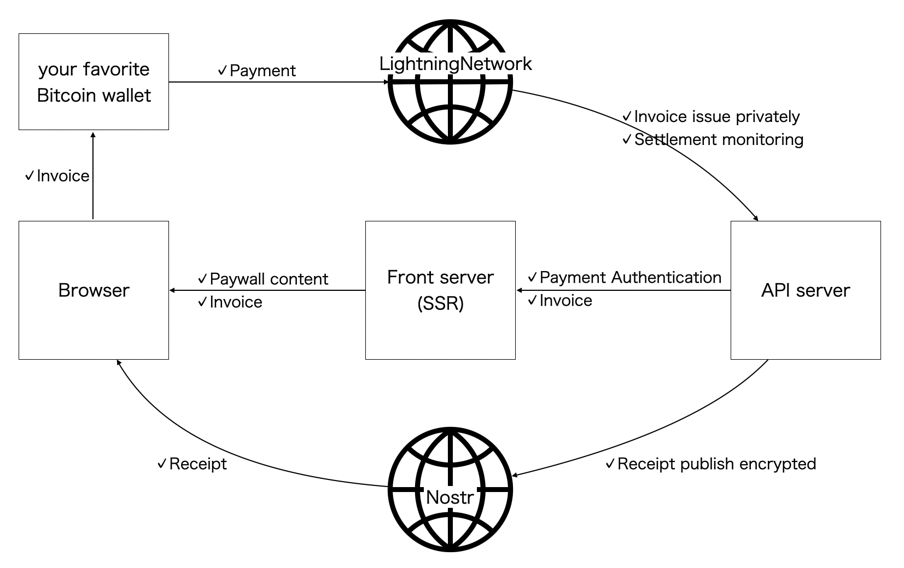
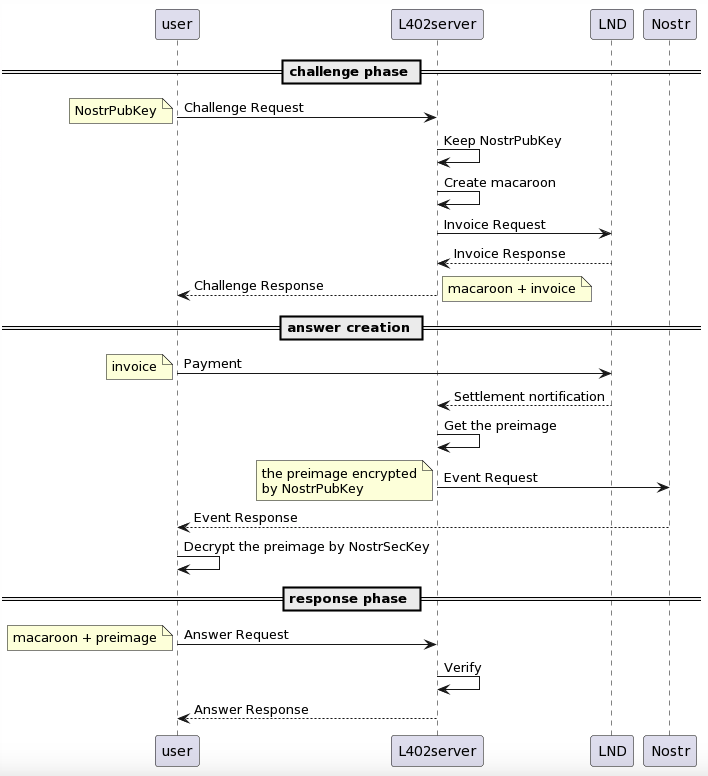
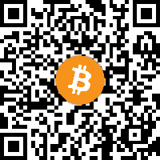

Knowledge is freedom and ignorance is slavery. - Miles Davis

Now that transitted to mainnet, I'll describe an overview and technical details.

## What is

This blog, "Self-Sovereign Blog", is a showcase for "Paywall Without Intermediaries". It will also be a showcase for Bitcoin as a medium of exchange.

"Paywall Without Intermediaries" means a paywall which does not require a blog platformer nor payment provider. It can give people the weapon of choice. The benefits for users include the following.

- No content moderation
- No review and approval/rejection
- No commission
- No expiry of degital points
- No setting of bank account

There are three keys to realizing above: Self-made, Bitcoin, and Nostr.

Blog is handcrafted by JavaScript framework, SvelteKit, and can be hosted anywhere. Payments for paywall use Bitcoin which is the border-less internet native money, specifically Lightning Network which is the layer2 of Bitcoin and enables fast finality and micro payments. The proof of payment is shared between buyers and sellers through messaging using the Nostr protocol.

Both Bitcoin and Nostr are the people's network without specific authorities. So, this paywall is "Self-Sovereignty", with no middlemen involved.

## Look and feel

It's simple. You see free content and pay-walled area, and can view whole article if unlocking Paywall. That's all.

### Demo

There are two steps to unlock Paywall: Nostr login and Lightning Network payment. Here is a demo video. You can also be available in [high resolution but larger file size version](https://self-sovereign.blog.teatwo.dev/articles/002_ligtning-nostr).

After two steps have done and whole article has shown, the end of video shows direct messaging of Nostr. That is the "receipt". There you can find a proof of payment, along with purchased item and purchase date.

## Means of realization

In the previous section, I mentioned three keys: Self-made, Bitcoin, and Nostr, but this article will not cover them in detail. Please see existing explanations. Instead, let's dive a little deeper here and explain the distinctive technical elements.

### 1. L402 protocol

Payment uses Lightning Network, and payment authentication/authorization for paywall follows the [Lightning HTTP 402 Protocol (L402 protocol)](https://github.com/lightning/blips/pull/26) that repurposes the `HTTP 402 Payment Required` error code and is a standardized way of adding micropayments to any existing HTTP-REST or gRPC API.

L402 is an incredible protocol that takes full advantage of Lightning Network's fast finality (no reorg) characteristics. This allows you to treat Lightning invoices just like an Auth token over http (I call it "paid token" though). I believe that the Lightning Network is essential for Bitcoin to become an internet protocol for money, and I think L402 will play a role in accelerating collaboration between web services. I would like to express my gratitude to the people at Lightning Labs who created this.

You are getting 402 error code when displaying a paywalled content. To be more precise, this is when viewing the invoice after logging into Nostr, since the Nostr login does not yet specifically communicate any payment flow.

Can you confirm that the invoice has arrived at the bottom right?

### 2. NIP-04 - Encrypted Direct Message

L402 requires buyer to provide proof of payment. That's where Nostr's Direct Messaging feature, [NIP-04](https://github.com/nostr-protocol/nips/blob/master/04.md), comes in. But I need to explain "proof of payment" before NIP-04 concisely.

The Lightning Network is a trustless system with no escrow. Or perhaps it would be better to say that escrow has been replaced by smart contracts through cryptography. Proof of payment refers to the preimage (also called payment secret), which is created by payee and exposed to payer in the last phaze of payment flow. Preimage which only payee knows is the original value of payment hash. So payer can calculate payment hash from preimage and confirm that payee is correct remittance destination by matching with payment hash inclueded the invoice.

NIP-04 is a specification to exchange direct message encrypted with AES-256-CBC. This blog uses it as the method to pass the preimage to payer. Therefore, you require nostr login to unlock paywalled content at first. This blog who is payee needs a Nostr pubkey of you who is payer, because AES-256-CBC encrypts and decrypts by shared keys created from both sender'key and receiver's key.

Of course, preimages are passed over the Lightning protocol as well. Although NIP-04 is not a strictly necessary process, think of it as a way to eliminate manuals and improve UX. You can see [the before world without NIP-04](https://self-sovereign.blog.teatwo.dev/articles/002_ligtning-nostr).

## Design

Let me explain how the above is structured. The Whole overview is below.

This blog itself consists of a browser, a front server, and an API server at the middle of the diagram, and payments flow through two networks at the top and bottom of the diagram.

Also, it shows the sequence of payment authentication/authorization for paywall. Please read to replace `L402 server` with front server and API server, and replace `LND` with Lightning Network.

It basically follows the flow of the L402 protocol, but has the addition that a Nostr event is issued on the L402 server side when an invoice settelment is detected. Again, keep in mind that this is what the Lightning protocol has already done and is duplicated for UX purposes.

One of the secrets in this experiment is that the L402 server is actually divided into a front server and an API server. I rely heavily on Lightning Labs' [Apertue](https://github.com/lightninglabs/aperture/tree/master) for most difficult authentication verification and handling of the Lightning Network. I don't have the skill to create this from scratch, so I would like to thank you for making this available under the MIT License.

However, I had one complaint about Aperture. That means it's difficult to combine the modern web, SSR/SSG frameworks on CDN. I wanted to treat Aperture behind serverless/edge worker or directly from the clients in parallel with content server, like general authentication solutions for building blog and commerce. But Aperture is intended the proxy server working on static host and designed to once catch all requests from clients. This is the base model of Aperture.

cite: https://github.com/ellemouton/aperture-demo

For that, I have folked the Apertue repository, changed a flow slightly, and reversed the responsibility between Aperture and content server. Now this blog is running on vercel while reaping the benefits of autoscaling. You can confirm by accessing to https://self-sovereign-blog.vercel.app/. Folked Aperture works as the entity of the API server. And now you can find a way to embed L402 into the way you usually build blog and commerce.

## Why Nostr

I'll also explain why I chose Nostr, as I'm sure you'll be some interested in this choice.

### 1. Sharing proof of payment

The main reason that adds Nostr is, again, to share proof of payment. I know, if Lightning payments all over the world are only WebLN that returns the preimage directly after the payment is completed, then Nostr doesn't need. But that isn't so. This blog cannot receive payment callbacks from mobile wallets, node wallets, etc. Nostr has made it universal.

However, Nostr may be too big a feature for that purpose alone. Most of the problems I receive from user testing are related to Nostr, as the Lightning area is robust thanks to Apreture. For example, mobile browser is slow or unresponsive (the cause is around websokect), DMs do not arrive (they are issued to the network, but the Nostr client does not catch them), etc. Complexity skyrocketed, especially in the client codebase.

Therefore, without the following two things, something like DID which is able to rotate key may be smarter just for encrypted communication between two parties.

### 2. Persistance of purchase proofs

The second is storing your assets on the internet. Nostr has servers and the data is being kept there. So, you can restore your purchase proofs even if you access from a different browser or change devices. Nostr is a type of decentralized network, and there are no specific actors, so it can be expected to continue forever. All you need is your Norstr secret key.

### 3. Content discovery

The third is to put the articles on the platform for content discovery. As you know, the motivation for using a blogging platform is not only to make it easier to build a blog site, but also to increase your chances of being discovered by your readers based on the filter bubble algorithm. Although Nostr is intended to fix existing social media problems, I recognize that it does not in any way deny the filter bubble itself. The problem with filter bubbles is algorithmic opacity and profit distribution. Nostr is not like that, the algorithm is transparent and user-selectable. I have noticed snort is already [experimenting with L402](https://github.com/v0l/snort/commit/d5032d64392234d8906a2d73857c5f9a9bd2bb79), and I am wondering that [NIP-23](https://github.com/nostr-protocol/nips/blob/master/23.md) will be able to publish a blog post that supports L402.

## Considerations

### Can't it be completed with just Lightning?

For this use case, I think it would be difficult for L402 to do it with just the Lightning protocol. You'll probably need to limit sort of wallet, or at most wrap invoices with an extension like LNURL. All we need to do is to be able to return the preimage directly to the app when paying from any wallet.

### Nostr secret key requirement increases risk

That's right. NIP-07 prevents secret key from exposing to this blog, but its operating environment is the same as WebLN, that is, only the web. Although progress has been made in the development of web extensions in mobile browsers, we still now need other solutions.

### Comparison with other paywalls using Lightning

There are several paywalls using Lightning. I don't know everything, but compared to the existing, privacy is honestly lower because the seller knows the buyer's Nostr account. But since the purchase proof is stored on Nostr (not cookies or blog host DB), I think that it has improved the decentralization of data persistence and the convenience being able to port across devices.

### A case that preimage cannot guarantee proof of payment

There is one problem for NIP-04, which though the message content is encrypted, others can see "who" is direct messaging with "whom". Preimage is obtained not only payer, but also intermediate nodes for payment routing. Therefore, when combined with NIP-04's messaging data, parties other than the payer may also get authorization for paywalled content. To avoid this, it is necessary to prevent routing nodes from acquiring preimages, or to completely hide the message passing a preimage from others. Therefore, this paywall currently has a vulnerability and will be treated as a proof-of-concept experiment.

### PLTC/BOLT12

The current L402 protocol appears to be designed just for BOLT11/HTLC. What happens if Lightning Network updates to PLTC? I don't think this is a problem at all. Rather, the above problem is resolved as the routing node will no longer be able to obtain the preimage. BOLT12 may be a little difficult as it is no longer just a one-shot invoice exchange. At least the sequence will be more complex. I am looking forward to seeing more flexibility in pricing, such as allowing payers to set prices and structuring subscriptions rather than paying per article.

### Any others

If you notice anything or have any concerns, please feel free to let me know: https://github.com/studioTeaTwo/self-sovereign-blog/issues

## The path to self-sovereign identity

"Paywall Without Intermediaries" is what gives people the weapon of choice. I am a developer who aspires to self-sovereign identity. I will continue to work toward this goal, and I would appreciate your support.

teatwo@getalby.com

Paths are made by walking - Franz Kafka
